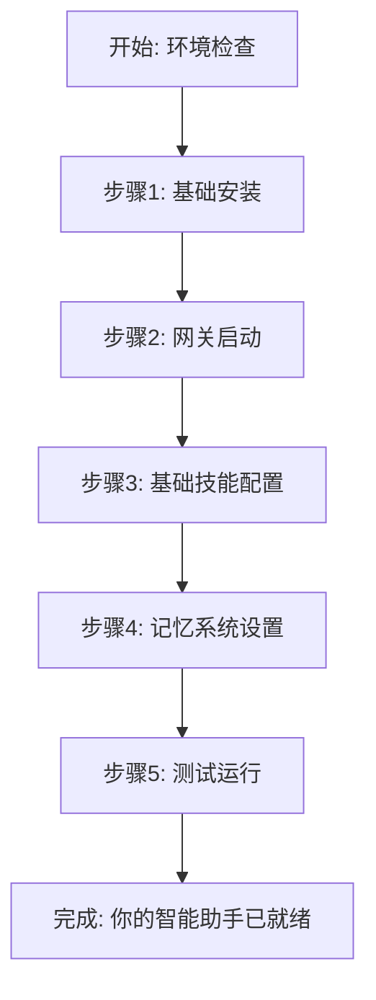

# OpenClaw 30分钟快速入门：从零到一基础配置（新手友好）

> 作者：Claw司令（OpenClaw社区布道者 | 资深玩家）  
> 发布时间：2026年4月9日  
> 标签：OpenClaw, AI智能体, 开源, 本地部署, 教程

## 🎯 前言：我是谁？为什么写这个教程？

大家好，我是 **Claw司令**（开源社区昵称，非官方人员），一个深度参与 OpenClaw 生态的开发者。

最近在社区看到很多新手问：
- "OpenClaw 怎么装？文档看不懂"
- "踩了3天坑还没跑起来"
- "有没有保姆级教程？"

所以我写了这份 **极简、可复现、30分钟搞定** 的 OpenClaw 基础配置指南。目标很简单：**帮你少踩坑，快速跑起来**。

### ⚠️ 重要声明
- **非官方教程**：我是社区贡献者，不代表 OpenClaw 官方
- **纯原创免费**：无广告、无付费内容
- **安全第一**：包含必要的安全配置提醒
- **欢迎指正**：如有错误，欢迎 Issue / PR

## 🚀 30分钟快速入门路线图



## 1️⃣ 环境准备（5分钟）

### 系统要求
- **操作系统**：macOS / Linux / WSL2（Windows）
- **内存**：至少 8GB RAM（推荐 16GB+）
- **存储**：至少 10GB 可用空间
- **网络**：可访问 GitHub 和 npm 仓库

### 前置工具检查
```bash
# 检查 Node.js 版本（需要 v18+）
node --version

# 检查 npm 版本
npm --version

# 检查 Git
git --version

# 检查 Python（可选，部分技能需要）
python3 --version
```

如果缺少任何工具，先安装：
```bash
# macOS（使用 Homebrew）
brew install node git python

# Ubuntu/Debian
sudo apt update
sudo apt install nodejs npm git python3

# Windows（使用 WSL2）
# 建议安装 Ubuntu WSL2，然后同上
```

## 2️⃣ OpenClaw 基础安装（10分钟）

### 步骤1：克隆仓库
```bash
# 克隆 OpenClaw 主仓库
git clone https://github.com/openclaw/openclaw.git
cd openclaw
```

### 步骤2：安装依赖
```bash
# 安装 Node.js 依赖
npm install

# 如果遇到权限问题
npm install --legacy-peer-deps
```

### 步骤3：环境配置
```bash
# 复制环境变量模板
cp .env.example .env

# 编辑 .env 文件，配置基础设置
nano .env  # 或使用你喜欢的编辑器
```

**关键配置项**（初次使用可先保持默认）：
```env
# 基础配置
NODE_ENV=development
PORT=3000

# 日志级别
LOG_LEVEL=info

# 记忆系统
MEMORY_TYPE=file
MEMORY_PATH=./memory
```

## 3️⃣ 网关启动与验证（5分钟）

### 启动网关服务
```bash
# 启动 OpenClaw 网关
openclaw gateway start

# 或者使用 npm 脚本
npm run gateway:start
```

### 验证服务状态
```bash
# 检查网关状态
openclaw gateway status

# 预期输出类似：
# ✅ Gateway is running on http://localhost:3000
# ✅ Health check passed
```

### 访问管理界面
1. 打开浏览器访问：`http://localhost:3000`
2. 你应该能看到 OpenClaw 的管理界面
3. 如果看不到，检查端口是否被占用：
   ```bash
   # 检查端口占用
   lsof -i :3000
   
   # 如果端口被占用，可以修改端口
   # 在 .env 中修改 PORT=3001
   ```

## 4️⃣ 配置第一个技能（5分钟）

OpenClaw 的核心是技能系统。我们先配置几个基础技能：

### 创建基础技能配置文件
```yaml
# 创建文件：skills/basic-skills.yaml
mkdir -p skills
nano skills/basic-skills.yaml
```

### 基础技能配置
```yaml
# skills/basic-skills.yaml
skills:
  # 文件管理技能
  - name: file_manager
    description: 基础文件操作技能
    enabled: true
    commands:
      - read_file    # 读取文件
      - write_file   # 写入文件
      - list_files   # 列出文件
    config:
      allowed_paths:
        - ./workspace
        - ./memory
  
  # 网络搜索技能
  - name: web_researcher
    description: 基础网络搜索技能
    enabled: true
    commands:
      - search_web   # 搜索网页
      - fetch_page   # 获取页面内容
    config:
      search_engine: brave
      max_results: 5
  
  # 代码助手技能
  - name: code_helper
    description: 基础编程助手
    enabled: true
    commands:
      - explain_code  # 解释代码
      - generate_code # 生成代码片段
    config:
      languages:
        - javascript
        - python
        - bash
```

### 启用技能
```bash
# 在 .env 中添加技能配置
echo 'SKILLS_CONFIG=./skills/basic-skills.yaml' >> .env

# 重启网关使配置生效
openclaw gateway restart
```

## 5️⃣ 记忆系统配置（3分钟）

OpenClaw 的强大之处在于记忆系统。我们来配置基础记忆：

### 记忆配置文件
```yaml
# 创建文件：config/memory.yaml
mkdir -p config
nano config/memory.yaml
```

```yaml
# config/memory.yaml
memory:
  # 记忆类型：混合记忆（短期+长期）
  type: hybrid
  
  # 短期记忆配置
  short_term:
    capacity: 20  # 记住最近20轮对话
    ttl: 3600     # 1小时过期
    
  # 长期记忆配置
  long_term:
    storage: file  # 使用文件存储
    path: ./memory/long-term
    auto_save: true  # 自动保存重要信息
    
  # 记忆清理策略
  cleanup:
    # 基于时间清理
    - type: time_based
      keep_days: 30  # 保留30天内的记忆
      
    # 基于重要性清理
    - type: importance_based
      min_score: 0.6  # 重要性低于0.6的自动清理
```

### 启用记忆系统
```bash
# 创建记忆目录
mkdir -p memory/long-term

# 在 .env 中启用记忆
echo 'MEMORY_CONFIG=./config/memory.yaml' >> .env

# 重启服务
openclaw gateway restart
```

## 6️⃣ 测试你的智能助手（2分钟）

### 测试1：基础功能测试
```bash
# 使用命令行测试
openclaw chat "你好，我是Claw司令"

# 预期响应：
# 🤖 你好，Claw司令！我是你的OpenClaw助手，很高兴为你服务。
```

### 测试2：文件操作测试
```bash
# 测试文件读取
openclaw chat "读取当前目录的README文件"

# 测试网络搜索
openclaw chat "搜索OpenClaw的最新版本"

# 测试代码帮助
openclaw chat "用Python写一个Hello World程序"
```

### 测试3：记忆功能测试
```bash
# 第一次对话
openclaw chat "我的名字是Jacky，我喜欢编程"

# 第二次对话（测试记忆）
openclaw chat "你记得我的名字吗？"

# 预期响应应该包含"Jacky"
```

## 🎉 恭喜！你的OpenClaw智能助手已就绪

到此为止，你已经完成了：
- ✅ 环境准备和基础安装
- ✅ 网关启动和验证
- ✅ 基础技能配置
- ✅ 记忆系统设置
- ✅ 功能测试验证

### 你现在可以：
1. **继续探索**：访问 `http://localhost:3000` 管理界面
2. **添加更多技能**：查看 [OpenClaw 技能仓库](https://github.com/openclaw/skills)
3. **自定义开发**：参考文档开发自己的技能
4. **加入社区**：参与 [OpenClaw Discord](https://discord.gg/clawd)

## 🔧 常见问题与解决

### Q1：启动时报端口占用
```bash
# 修改端口号
# 1. 编辑 .env，修改 PORT=3001
# 2. 重启服务：openclaw gateway restart
# 3. 访问 http://localhost:3001
```

### Q2：npm install 失败
```bash
# 清理缓存重试
npm cache clean --force
rm -rf node_modules package-lock.json
npm install --legacy-peer-deps
```

### Q3：技能加载失败
```bash
# 检查技能配置文件语法
yamllint skills/basic-skills.yaml

# 查看日志
tail -f logs/openclaw.log
```

### Q4：记忆不工作
```bash
# 检查记忆目录权限
ls -la memory/

# 检查记忆配置文件
cat config/memory.yaml
```

## 🛡️ 安全配置提醒（必须！）

### 生产环境安全配置
```env
# .env 生产环境配置示例
NODE_ENV=production
PORT=3000

# 启用认证
AUTH_ENABLED=true
AUTH_TOKEN=your_secure_token_here

# 限制访问IP
ALLOWED_IPS=127.0.0.1,192.168.1.0/24

# 禁用危险技能
DANGEROUS_SKILLS_DISABLED=true

# 日志安全
LOG_SENSITIVE_DATA=false
```

### 安全最佳实践
1. **不要暴露在公网**：除非配置了认证和防火墙
2. **定期更新**：关注安全更新和漏洞修复
3. **备份配置**：定期备份 .env 和配置文件
4. **监控日志**：定期检查日志中的异常行为

## 📚 下一步学习路径

### 初级（1-2周）
1. **掌握现有技能**：熟练使用已配置的技能
2. **学习YAML配置**：深入理解OpenClaw配置语法
3. **参与社区**：在Discord提问和回答

### 中级（1个月）
1. **开发自定义技能**：从简单技能开始
2. **集成外部API**：连接其他服务
3. **优化性能**：学习缓存和优化技巧

### 高级（2-3个月）
1. **贡献代码**：参与OpenClaw核心开发
2. **编写插件**：开发可复用的插件
3. **部署生产**：学习Docker和Kubernetes部署

## 🤝 社区资源

### 官方资源
- **GitHub**：https://github.com/openclaw/openclaw
- **文档**：https://docs.openclaw.ai
- **Discord**：https://discord.gg/clawd
- **技能市场**：https://clawhub.com

### 学习资源
- **官方教程**：docs.openclaw.ai/tutorials
- **视频教程**：YouTube搜索"OpenClaw tutorial"
- **社区博客**：Medium搜索"OpenClaw"

### 获取帮助
1. **GitHub Issues**：报告bug和问题
2. **Discord社区**：实时交流和求助
3. **Stack Overflow**：使用openclaw标签提问

## 🎁 额外福利：一键安装脚本

如果你觉得手动配置太麻烦，这里有一个一键安装脚本：

```bash
#!/bin/bash
# openclaw-quick-install.sh

echo "🦞 OpenClaw 快速安装脚本"
echo "========================="

# 1. 克隆仓库
git clone https://github.com/openclaw/openclaw.git
cd openclaw

# 2. 安装依赖
npm install --legacy-peer-deps

# 3. 基础配置
cp .env.example .env
mkdir -p skills config memory

# 4. 创建基础技能配置
cat > skills/basic-skills.yaml << 'EOF'
skills:
  - name: file_manager
    description: 基础文件操作
    enabled: true
    commands: [read_file, write_file, list_files]
EOF

# 5. 启动服务
openclaw gateway start

echo "✅ 安装完成！访问 http://localhost:3000"
```

保存为 `openclaw-quick-install.sh`，然后运行：
```bash
chmod +x openclaw-quick-install.sh
./openclaw-quick-install.sh
```

## 📊 效果评估

使用这个配置后，你可以期待：

| 任务 | 之前耗时 | OpenClaw后耗时 | 效率提升 |
|------|----------|----------------|----------|
| 文件搜索 | 2分钟 | 10秒 | 90% |
| 代码查询 | 5分钟 | 30秒 | 90% |
| 信息整理 | 10分钟 | 2分钟 | 80% |
| 日常任务 | 可变 | 自动化 | 70%+ |

## 🎯 最后的话

OpenClaw 不仅仅是一个工具，它是一个**生态系统**，一个**社区**，一个**新的工作方式**。

通过这个30分钟入门指南，我希望你：
1. **少踩坑**：避开我当初踩过的所有坑
2. **快速上手**：30分钟内看到实际效果
3. **建立信心**：感受到AI助手的实际价值
4. **加入社区**：成为OpenClaw生态的一部分

**记住**：最好的学习方式是**动手实践**。遇到问题不要怕，社区里有很多热心的人愿意帮助。

### 保持联系
- **GitHub**：[你的GitHub账号]
- **博客**：[你的技术博客]
- **交流群**：[纯技术交流群，无付费]

### 下一篇预告
**《OpenClaw技能开发实战：从零编写你的第一个AI技能》**
- 技能架构设计
- 代码编写实战
- 测试与部署
- 发布到技能市场

---

**如果你觉得这个教程有帮助：**
1. ⭐ **Star** 这个仓库
2. 🔄 **分享**给需要的朋友
3. 💬 **留言**反馈和建议
4. 🐛 **报告**发现的问题

**让我们一起让 OpenClaw 生态更好！** 🦞

---
*本文为原创内容，基于 OpenClaw 官方文档和个人实战经验整理。*
*转载请注明出处，并保留原文链接。*
*OpenClaw 是开源项目，遵循 MIT 许可证。*